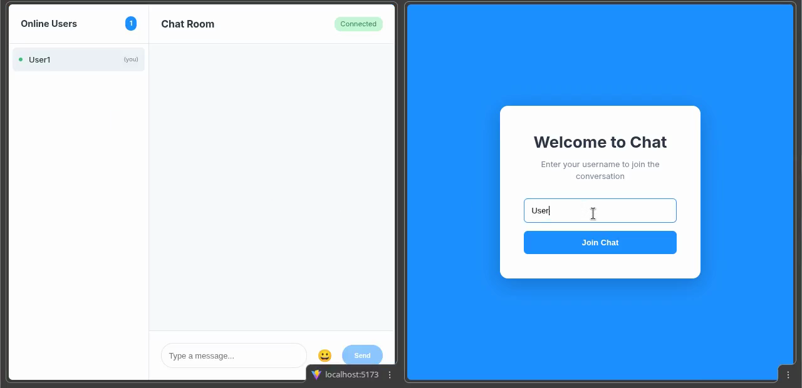
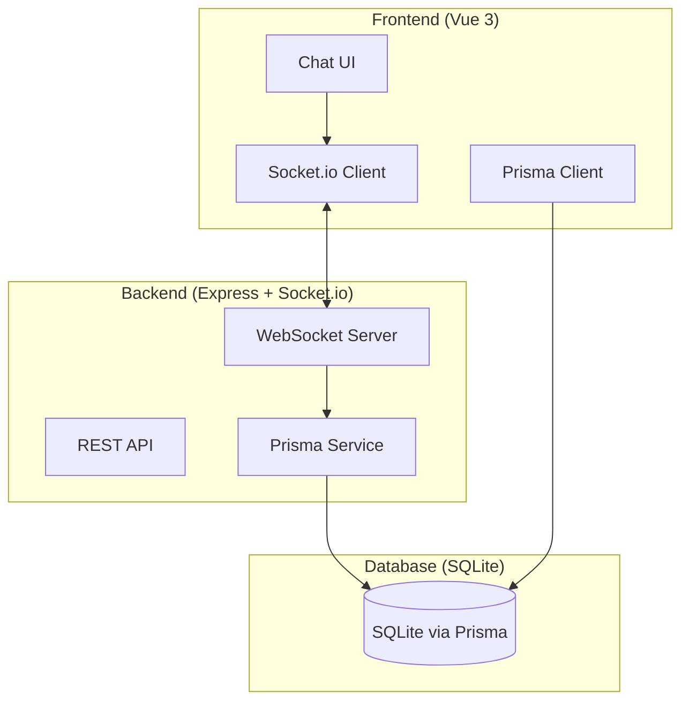

# Real-Time Chat Application

[Español](./README_es.md)

A modern, real-time chat application built with Vue 3, TypeScript, Express, Socket.io, and Prisma.

## Demo
<!-- [](./demo.mp4) -->
[](https://github.com/user-attachments/assets/51b0f641-e563-4157-913b-6d2a671d5bfb)
### [Demo video](./demo.mp4)

## Features

- Real-time messaging with WebSocket support
- Online users list with live status updates
- Emoji picker for expressive messaging
- Clean, modern UI
- Responsive design for mobile and desktop
- Persistent message history stored in Prisma (SQLite)

## Tech Stack

- **Frontend**: Vue 3, TypeScript, Vite
- **Backend**: Express.js, Socket.io
- **Database**: Prisma (SQLite)
- **Real-time**: WebSockets via Socket.io

## Prerequisites

- Node.js (v16 or higher)
- npm or yarn

## Setup

1. Install dependencies:
```bash
npm install
```

2. Set up the database:
```bash
npx prisma generate
npx prisma db push
```

3. Create a `.env` file in the root directory:
```env
DATABASE_URL="file:./prisma/data/dev.db"
```

4. The database schema is already set up with the following tables:
   - `User`: Stores user information
   - `Message`: Stores all chat messages

## Running the Application

You need to run both the frontend and backend servers:

1. Start the frontend development server:
```bash
npm run dev
```

2. In a separate terminal, start the WebSocket server:
```bash
npm run dev:server
```

3. Open your browser and navigate to `http://localhost:5173`

## How to Use

1. Enter a username when prompted
2. Start chatting with other users in real-time
3. See who's online in the sidebar
4. Click the emoji button to add emojis to your messages
5. Your messages are automatically saved and will persist across sessions

## Project Structure

```
├── src/
│   ├── components/
│   │   ├── ChatRoom.vue       # Main chat interface
│   │   └── EmojiPicker.vue    # Emoji selection component
│   ├── composables/
│   │   └── useSocket.ts       # Socket.io connection logic
│   ├── lib/
│   │   └── db.ts                 # Prisma client setup
├── prisma/
│   └── schema.prisma             # Database schema
├── server/
│   └── index.js                  # Express + Socket.io server
└── README.md
```

## Architecture



## Building for Production

```bash
npm run build
```

The built files will be in the `dist/` directory.

## License
MIT © Yonier E.
