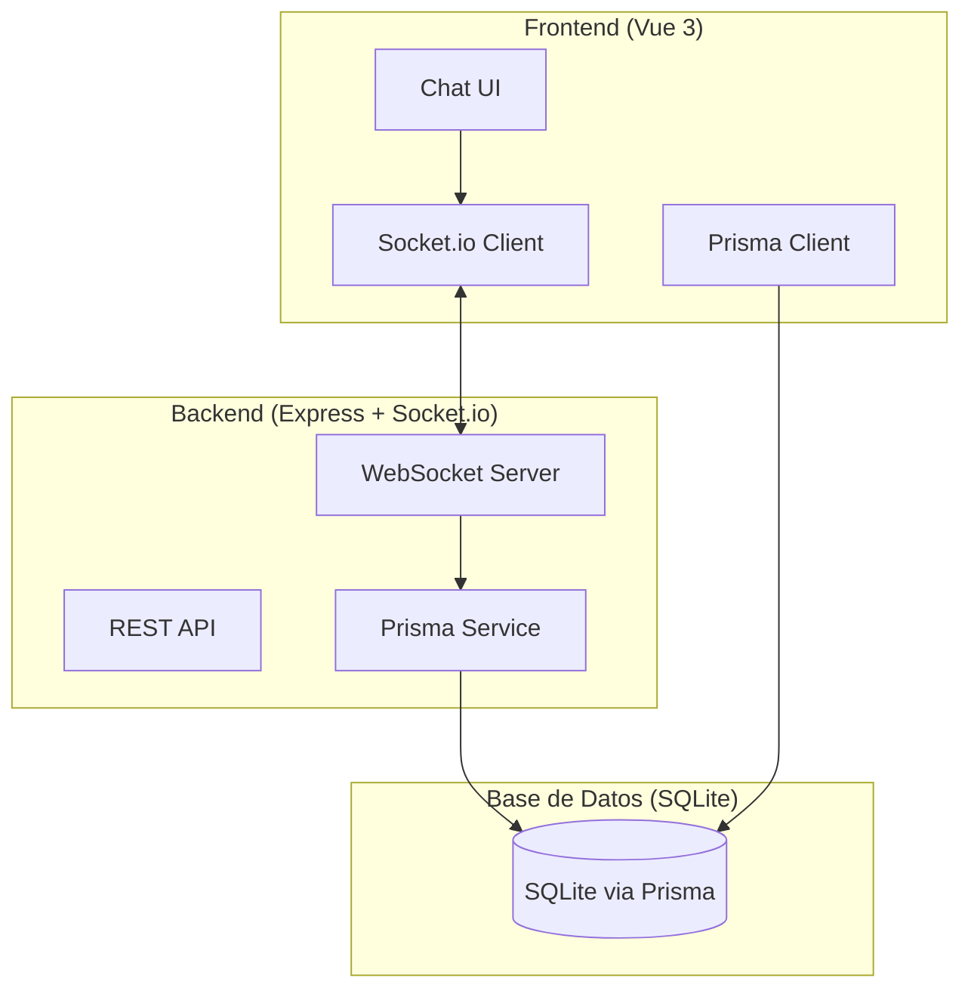

# Aplicación de Chat en Tiempo Real

[English](./README.md)

Una aplicación de chat en tiempo real moderna construida con Vue 3, TypeScript, Express, Socket.io y Prisma.

## Demo
[](./demo.mp4)

## Características

- Mensajería en tiempo real con soporte WebSocket
- Lista de usuarios en línea con actualizaciones de estado en vivo
- Selector de emojis para mensajes expresivos
- Interfaz de usuario limpia y moderna
- Diseño responsivo para móvil y escritorio
- Historial de mensajes persistido en Prisma (SQLite)

## Tecnologías

- **Frontend**: Vue 3, TypeScript, Vite
- **Backend**: Express.js, Socket.io
- **Base de datos**: Prisma (SQLite)
- **Tiempo real**: WebSockets via Socket.io

## Requisitos

- Node.js (v16 o superior)
- npm o yarn

## Configuración

1. Instala las dependencias:
```bash
npm install
```

2. Configura la base de datos:
```bash
npx prisma generate
npx prisma db push
```

3. Crea un archivo `.env` en el directorio raíz:
```env
DATABASE_URL="file:./prisma/data/dev.db"
```

4. El esquema de la base de datos ya está configurado con las siguientes tablas:
   - `User`: Almacena información de usuarios
   - `Message`: Almacena todos los mensajes de chat

## Ejecutando la Aplicación

Necesitas ejecutar tanto el servidor frontend como el backend:

1. Inicia el servidor de desarrollo del frontend:
```bash
npm run dev
```

2. En una terminal separada, inicia el servidor WebSocket:
```bash
npm run dev:server
```

3. Abre tu navegador y navega a `http://localhost:5173`

## Cómo Usar

1. Ingresa un nombre de usuario cuando se te pida
2. Comienza a chatear con otros usuarios en tiempo real
3. Mira quién está en línea en la barra lateral
4. Haz clic en el botón de emoji para agregar emojis a tus mensajes
5. Tus mensajes se guardan automáticamente y persistirán entre sesiones

## Estructura del Proyecto

```
├── src/
│   ├── components/
│   │   ├── ChatRoom.vue       # Interfaz de chat principal
│   │   └── EmojiPicker.vue    # Componente de selección de emojis
│   ├── composables/
│   │   └── useSocket.ts       # Lógica de conexión Socket.io
│   ├── lib/
│   │   └── db.ts              # Configuración del cliente Prisma
├── prisma/
│   └── schema.prisma          # Esquema de la base de datos
├── server/
│   └── index.js               # Servidor Express + Socket.io
└── README.md
```

## Arquitectura



## Construir para Producción

```bash
npm run build
```

Los archivos generados estarán en el directorio `dist/`.

## Licencia
MIT © Yonier E.
